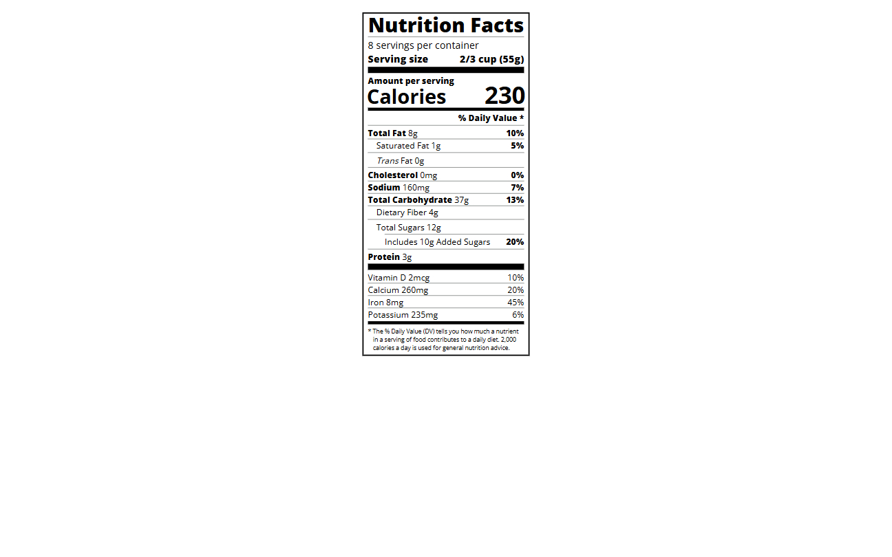

# Nutrition Label | FCC Responsive Web Design Certification

**Project 8/20**

This project recreates a realistic nutrition label using only HTML and CSS 🥣. It's a pixel-perfect layout mimicking the structure and spacing of labels found on food packaging. The challenge was all about precision, spacing, and mastering layout techniques using plain CSS 💪.

---

## 📚 Table of Contents

- [🔎 Overview](#-overview)
  - [📸 Screenshot](#-screenshot)
  - [🔗 Links](#-links)
  - [📌 Features](#-features)
- [🧠 My process](#-my-process)
  - [🛠️ Built with](#️-built-with)
  - [🎓 What I learned](#-what-i-learned)
  - [🔙 Previous Project](#-previous-project)
  - [🔜 Next Project](#-next-project)
- [👤 Author](#-author)
  - [🌐 Connect with Me](#-connect-with-me)
  - [💻 Coding Profiles](#-coding-profiles)

---

## 🔎 Overview

### 📸 Screenshot

### 🔗 Links

 - [🔴 Live Demo](https://dalascript.github.io/nutrition-label/)
 - [🗂️ GitHub Repository](https://github.com/DalaScript/nutrition-label)

### 📌 Features

 - ✅ Pixel-accurate nutrition label layout
 - ✅ Responsive, centered label container
 - ✅ Semantic HTML structure with headings and sections
 - ✅ Custom dividers for visual separation
 - ✅ Bold text, indentation, and flexible spacing

## 🧠 My Process

### 🛠️ Built with

 - HTML5
 - CSS3

### 🎓 What I Learned

 - How to structure complex layouts with plain HTML and CSS
 - Using margins, indentation, and borders for visual hierarchy
 - Flexbox for alignment of text and nutritional values
 - Applying utility classes (bold, indent, divider) to keep styles reusable and clean

  > 🚀 For me, this project was more about **practice** and gaining additional **experience**,  
  > rather than learning something entirely new.  
  >  
  > 👨‍💻 Since I’m not a beginner and already familiar with these technologies,  
  > I approached it with confidence — and still, I truly **enjoyed working on it**.  
  >  
  > 🎯 Overall, I consider this a very **valuable and enjoyable experience**.

### 🔙 Previous Project

 - Photo Gallery | *[Project 7/20]* → [View Repository](https://github.com/DalaScript/photo-gallery)

### 🔜 Next Project

 - Quiz | *[Project 9/20]* → [View Repository](https://github.com/DalaScript/quiz)

---

## 👤 Author

### 🌐 Connect with Me

 - [Instagram](https://www.instagram.com/DalaScript)
 - [YouTube](https://www.youtube.com/@DalaScript)

### 💻 Coding Profiles

 - [freeCodeCamp](https://www.freecodecamp.org/DalaScript)
 - [FrontendMentor](https://www.frontendmentor.io/profile/DalaScript)
 - [GitHub](https://github.com/DalaScript)

*🙌 Thanks for checking out my project! More coming soon. Stay tuned 🚀*